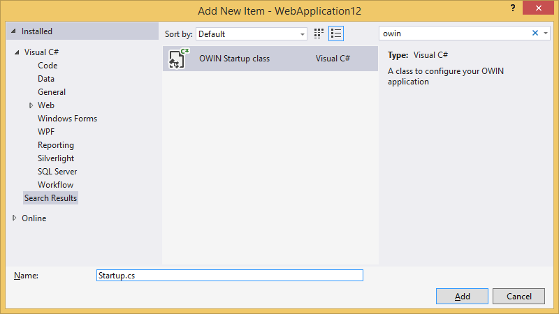



# System Information Dashboard
[](https://www.nuget.org/packages/Snork.AspNet.Dashboard.SysInfo/) 


This is a plug-in dashboard for ASP.NET applications that outputs a large amount of information about the application's current state. This includes information about compilation options and extensions, the .NET version, server information and environment, the environment, OS version information, paths, master and local values of configuration options, and HTTP headers.

## Adding the Dashboard to Your Application
The [OWIN Startup class](https://docs.microsoft.com/en-us/aspnet/aspnet/overview/owin-and-katana/owin-startup-class-detection) is intended to keep web application bootstrap logic in a single place. In Visual Studio 2013 or later, you can add it by right clicking on the project and choosing the Add / OWIN Startup Class menu item.



If you have Visual Studio 2012 or earlier, just create a regular class in the root folder of your application, name it `Startup` and place the following contents:
```
using Microsoft.Owin;
using MvcSample;
using Owin;
using Snork.AspNet.Dashboard.SysInfo;

[assembly: OwinStartup(typeof(Startup))]

namespace MyWebApplication
{
    public class Startup
    {
        public void Configuration(IAppBuilder app)
        {
            // Map Dashboard to the `http://<your-app>/sysinfo` URL.
            app.UseSysInfoDashboard();
        }
    }
}
```
After performing these steps, open your browser and hit the *http://your-app/sysinfo* URL to see the Dashboard.

## Configuring Authorization
The dashboard exposes sensitive information about your web server, so it is really important to restrict access to it.  By default, only local requests are allowed.  You can change this by passing your own implementations of the `IDashboardAuthorizationFilter` interface, whose `Authorize` method is used to allow or prohibit a request. The first step is to provide your own implementation.

``


# System Information Dashboard
[](https://www.nuget.org/packages/Snork.AspNet.Dashboard.SysInfo/) 


This is a plug-in dashboard for ASP.NET applications that outputs a large amount of information about the application's current state. This includes information about compilation options and extensions, the .NET version, server information and environment, the environment, OS version information, paths, master and local values of configuration options, and HTTP headers.

## Adding the Dashboard to Your Application
The [OWIN Startup class](https://docs.microsoft.com/en-us/aspnet/aspnet/overview/owin-and-katana/owin-startup-class-detection) is intended to keep web application bootstrap logic in a single place. In Visual Studio 2013 or later, you can add it by right clicking on the project and choosing the Add / OWIN Startup Class menu item.


If you have Visual Studio 2012 or earlier, just create a regular class in the root folder of your application, name it `Startup` and place the following contents:
```
using Microsoft.Owin;
using MvcSample;
using Owin;
using Snork.AspNet.Dashboard.SysInfo;

[assembly: OwinStartup(typeof(Startup))]

namespace MyWebApplication
{
    public class Startup
    {
        public void Configuration(IAppBuilder app)
        {
            // Map Dashboard to the `http://<your-app>/sysinfo` URL.
            app.UseSysInfoDashboard();
        }
    }
}
```
After performing these steps, open your browser and hit the *http://your-app/sysinfo* URL to see the Dashboard.

## Configuring Authorization
The dashboard exposes sensitive information about your web server, so it is really important to restrict access to it.  By default, only local requests are allowed.  You can change this by passing your own implementations of the `IDashboardAuthorizationFilter` interface, whose `Authorize` method is used to allow or prohibit a request. The first step is to provide your own implementation.

```
public class MyAuthorizationFilter : IDashboardAuthorizationFilter
{
    public bool Authorize(DashboardContext context)
    {
        // In case you need an OWIN context, use the next line, `OwinContext` class
        // is the part of the `Microsoft.Owin` package.
        var owinContext = new OwinContext(context.GetOwinEnvironment());

        // Allow all authenticated users to see the Dashboard (potentially dangerous).
        return owinContext.Authentication.User.Identity.IsAuthenticated;
    }
}
```

The second step is to pass it to the UseHangfireDashboard method. You can pass multiple filters, and the access will be granted only if all of them return true.

```
app.UseSysInfoDashboard("/sysinfo", new DashboardOptions
{
    Authorization = new [] { new MyAuthorizationFilter() }
});
```

## Changing the URL Mapping
By default, the UseSysInfoDashboard method maps the Dashboard to the /sysinfo path. If you want to change this for one reason or another, just pass your URL path.
```
// Map the Dashboard to the root URL
app.UseSysInfoDashboard("");

// Map to the `/someotherpath` URL
app.UseSysInfoDashboard("/someotherpath");
```

## Change 'Return to Application' Link
By default, the 'Return to Application' link (top-left corner of Dashboard) leads you to the root URL of your application. In order to change it, use the DashboardOptions class.

```
// Change `Back to site` link URL
var options = new DashboardOptions { AppPath = "http://your-app.net" };
// Make `Back to site` link working for subfolder applications
var options = new DashboardOptions { AppPath = VirtualPathUtility.ToAbsolute("~") };

app.UseSysInfoDashboard("/sysinfo", options);
```
